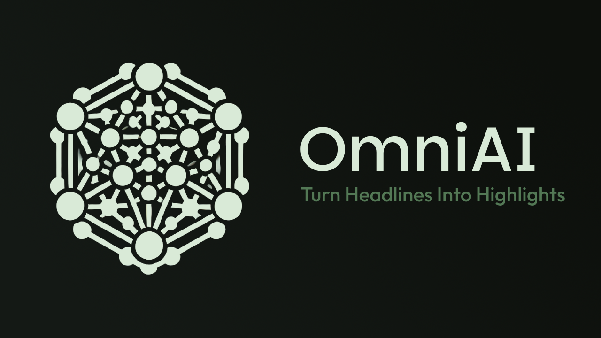

<!-- omit in toc -->
# OmniAI - Turn Headlines Into Highlights 📰🕶️
*Are you struggling to keep your audience engaged with fresh, eye-catching content?*

Our app finds the latest news and instantly turns it into stunning posts, videos, and memes—perfect for any platform. Engage effortlessly and stay ahead!

<!-- omit in toc -->
### News Articles, Summarized for:  
- **Memes**  
- **Text Posts**  
- **Images**  
- **Videos**

---

<a href="https://example.com" style="display: inline-block; background-color: #4CAF50; color: white; padding: 10px 20px; text-align: center; text-decoration: none; font-size: 16px; border-radius: 5px;">🚀 Click here to interact with our chatbot 🤖 now!</a>

**👇 Click the image to watch the demo video**
[](https://www.youtube.com/watch?v=dQw4w9WgXcQ)

<!-- omit in toc -->
## 📑 Table of Contents

- [🧠 Usage](#-usage)
- [🛠️ Getting Started](#️-getting-started)
  - [📋 Prerequisites](#-prerequisites)
  - [🏁 Installation Steps](#-installation-steps)
- [🤖 AI APIs Utilized](#-ai-apis-utilized)
- [📄 Additional Documentation](#-additional-documentation)


## 🧠 Usage

(TODO: Update usage instructions after completing the demo video.)

## 🛠️ Getting Started

### 📋 Prerequisites

Before starting, ensure you have the following:

1. [Node.js](https://nodejs.org/en/download/package-manager) - Required runtime environment.
2. [NPM](https://docs.npmjs.com/downloading-and-installing-node-js-and-npm) - Package manager for JavaScript.
3. API Keys:
   - [Groq](https://groq.com/): Refer to the [instructions](https://console.groq.com/keys) to create and retrieve your API key.
   - [Novita AI](https://novita.ai/): Refer to the [quickstart guide](https://novita.ai/docs/get-started/quickstart.html#_1-go-to-novita-ai-and-log-in) to obtain your API key.
   - [NewsAPI](https://newsapi.org/): Refer to the [documentation](https://newsapi.org/docs/get-started) for API key generation.

### 🏁 Installation Steps

1. **Clone the Repository:**
    ```bash
    git clone https://github.com/Kulsgam/genai_hack_global.git
    cd genai_hack_global
    ```

2. **Configure the Environment Variables:**
    - Create a `.env` file in the root directory.
    - Add your API keys as follows or as outlined in [example.env](./example.env):
      ```
      GROQ_API_KEY=<GROQ_API_KEY>
      NOVITA_API=<NOVITA_API>
      NEWS_API_KEY=<NEWS_API_KEY>
      ```

3. **Install Dependencies:**
    - Run the following command to install all dependencies:
      ```bash
      npm install
      ```

4. **Start the Application:**
    - Run the application locally with:
      ```bash
      npm run dev
      ```
    - Open the deployed URL ([Default URL](http://localhost:3000)) in your browser to view the app.

## 🤖 AI APIs Utilized

1. **Groq**: [Llama3](https://groq.com/) - Large language model capabilities.
2. **Pollination.ai**: [Image generation API](https://pollinations.ai/) - Visual asset creation.
3. **Novita.ai**: [Video generation API](https://novita.ai/) - Dynamic video generation.
4. **NewsAPI.org**: [API for fetching news articles](https://pollinations.ai/) - Real-time news data.

---

## 📄 Additional Documentation

Stay tuned for more details and usage guides coming soon!
